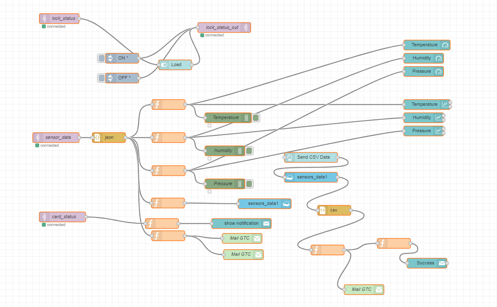
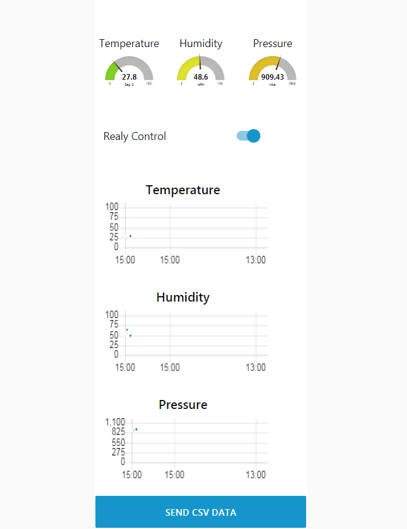

# E14_AWS_IoT_STM32
An IoT project around STM32L475 discovery board. The project is about sending the sensors data to AWS and plotting the received data in Graphs....

## Important:

* Due to lack of hardware, testing with [JAVA SDK](https://github.com/aws/aws-iot-device-sdk-java) from ubuntu.

## MBED Libraries
* [HTS221Sensor](https://os.mbed.com/teams/ST/code/HTS221/)
* [LPS22HBSensor](https://os.mbed.com/teams/ST/code/LPS22HB)

## Node-RED Dependencies [Server URL](https://gtcnodered.eu-gb.mybluemix.net/red/#)
* [Node-Red Dashboard](https://flows.nodered.org/node/node-red-dashboard)

## Screenshots
Node-RED Flow       
  
Node-RED Dashboard       
  

